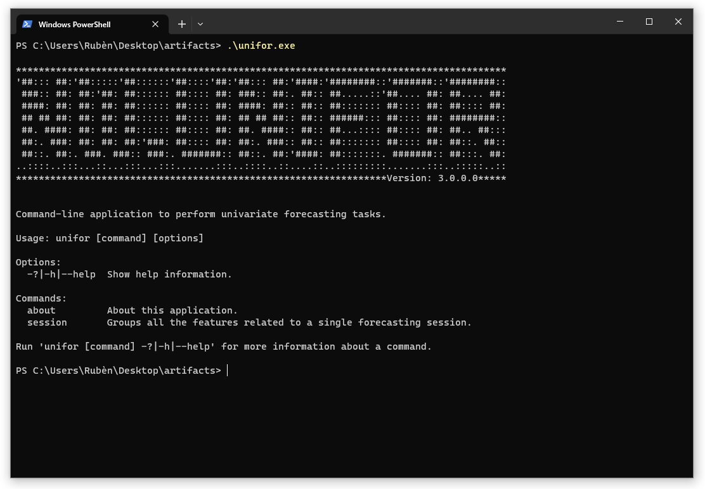

# NW.UnivariateForecastingClient
Contact: numbworks@gmail.com

## Revision History

| Date | Author | Description |
|---|---|---|
| 2021-10-13 | numbworks | Created. |
| 2023-01-22 | numbworks | Updated to v2.5.0. |

## Introduction



`NW.UnivariateForecastingClient` (`unifor.exe`) is the command-line client for the `NW.UnivariateForecasting` library.

## Overview

The command-line interface for `NW.UnivariateForecastingClient` is summarized by the following table:

|Command|Sub Command|Options|Exit Codes|
|---|---|---|---|
|about|||Success|
|session|||Success|

The regular font indicates the mandatory options, while the *italic*  font indicates an optional ones.

The exit codes are summarized below:

|Label|Value|
|---|---|
|Success|0|
|Failure|1|

## Getting started

In this document I'll use `Windows` as reference OS, but the procedures are exactly the same on both `Linux` and `Mac`.

To get started:

1. download the application from the [Releases](https://github.com/numbworks/NW.UnivariateForecasting/releases) page on Github and unzip it;
2. open a command prompt, such as Windows Terminal;
3. navigate to the application folder;
4. familiarize with each `Command`, `Sub Command` and `Option` provided by the application, such as:

```powershell
PS C:\unifor>.\unifor.exe
PS C:\unifor>.\unifor.exe session
PS C:\unifor>.\unifor.exe about
```

## Markdown Toolset

Suggested toolset to view and edit this Markdown file:

- [Visual Studio Code](https://code.visualstudio.com/)
- [Markdown Preview Enhanced](https://marketplace.visualstudio.com/items?itemName=shd101wyy.markdown-preview-enhanced)
- [Markdown PDF](https://marketplace.visualstudio.com/items?itemName=yzane.markdown-pdf)