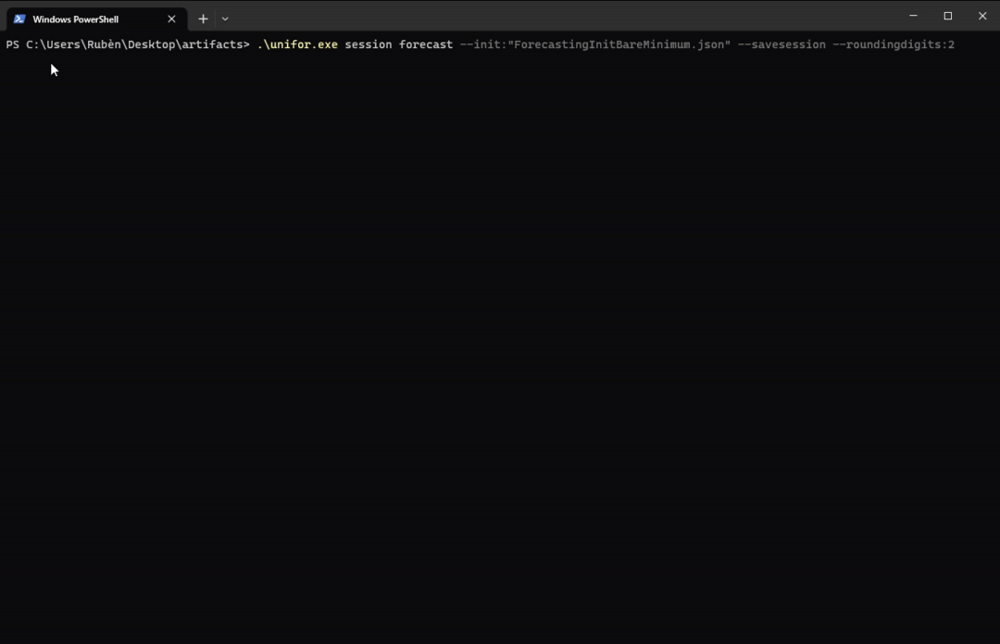

# NW.UnivariateForecastingClient
Contact: numbworks@gmail.com

## Revision History

| Date | Author | Description |
|---|---|---|
| 2021-10-13 | numbworks | Created. |
| 2023-01-22 | numbworks | Updated to v2.5.0. |
| 2023-03-09 | numbworks | Updated to v3.0.0. |

## Introduction


`NW.UnivariateForecastingClient` (`unifor.exe`) is the command-line client for the `NW.UnivariateForecasting` library.

## Overview

The command-line interface for `NW.UnivariateForecastingClient` is summarized by the following table:

|Command|Sub Command|Options|Exit Codes|
|---|---|---|---|
|about|||Success|
|session|||Success|
|session|forecast|--init:{filename}<br />*--folderpath:{path}*<br />*--savesession*<br />*--roundingdigits:{number}*<br />*--forecastingdenominator:{number}*|Success<br />Failure|

The regular font indicates the mandatory options, while the *italic*  font indicates an optional ones.

The exit codes are summarized below:

|Label|Value|
|---|---|
|Success|0|
|Failure|1|

## Getting started

In this document I'll use `Windows` as reference OS, but the procedures are exactly the same on both `Linux` and `Mac`.

To get started:

1. download the application from the [Releases](https://github.com/numbworks/NW.UnivariateForecasting/releases) page on Github and unzip it;
2. open a command prompt, such as Windows Terminal;
3. navigate to the application folder;
4. familiarize with each `Command`, `Sub Command` and `Option` provided by the application, such as:

```powershell
PS C:\unifor>.\unifor.exe
PS C:\unifor>.\unifor.exe session
PS C:\unifor>.\unifor.exe session forecast --help
PS C:\unifor>.\unifor.exe about
```

## Commands: session forecast



The simplest command you can run is `session forecast`, which performs a forecasting task on the values you provide. At very least, the command will look like:

```powershell
PS C:\unifor>.\unifor.exe session forecast --init:Init.json
```

The command above requires that you have the required file (`Init.json`) located in the same folder as the application, which by default it's the working folder for all the application's activities. 

The command above will log something like this to the console:

```
...

...
```

If you wish to store the files elsewhere, you can specify a new working folder by using the `folderpath` option - i.e. `--folderpath:C:\Documents`

## Markdown Toolset

Suggested toolset to view and edit this Markdown file:

- [Visual Studio Code](https://code.visualstudio.com/)
- [Markdown Preview Enhanced](https://marketplace.visualstudio.com/items?itemName=shd101wyy.markdown-preview-enhanced)
- [Markdown PDF](https://marketplace.visualstudio.com/items?itemName=yzane.markdown-pdf)